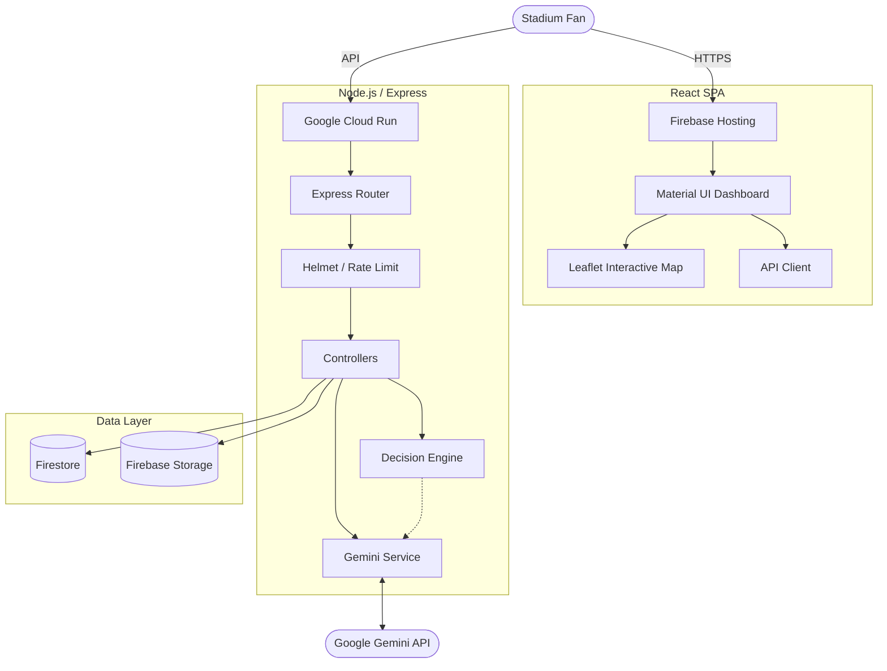

# System Architecture Documentation

## Enterprise Cloud Architecture
CrowdSense AI uses a decoupled, serverless architecture deployed on Google Cloud Platform.

## Component Breakdown

### 1. Frontend (Firebase Hosting)
- **Vite React**: Chosen for sub-second HMR during development and heavily optimized build sizes.
- **State Management**: React Hooks (`useState`, `useEffect`) avoiding Redux overhead for a highly localized routing app.
- **Mapping**: `react-leaflet` consumes GeoJSON to render dynamic heatmaps.

### 2. Backend (Cloud Run)
- **Node.js**: Asynchronous event loop is perfectly suited for handling simultaneous I/O (Firestore reads, Gemini API requests).
- **Auto-Scaling**: Configured to scale from 0 to 100 instances, paying exactly $0 during downtime.

### 3. Decision Engine (Core IP)
- **Deterministic First**: Unlike pure LLM apps, our Decision Engine strictly calculates the mathematical truth *before* AI is involved. This guarantees 0% chance of a fan being routed to a closed or burning gate.

### 4. Gemini AI
- **Role**: Translator and Explainer.
- **Model**: `gemini-1.5-flash` for < 1000ms response times.

### 5. Security & Persistence (Firebase SRE)
- **Security Rules**: Strict `firebase.rules` and `storage.rules` block all client-side writes. Only the authenticated Cloud Run Node.js backend (Admin SDK) is permitted to mutate stadium states.
- **Indexes**: `firestore.indexes.json` implements composite indexing to ensure $O(1)$ query speeds on recommendation history regardless of data size.
- **Disaster Recovery**: All raw CSVs are preserved in Firebase Storage to allow instant rollback of corrupted stadium states, while Cloud Run traffic-splitting allows instant reversion of bad deployments.

